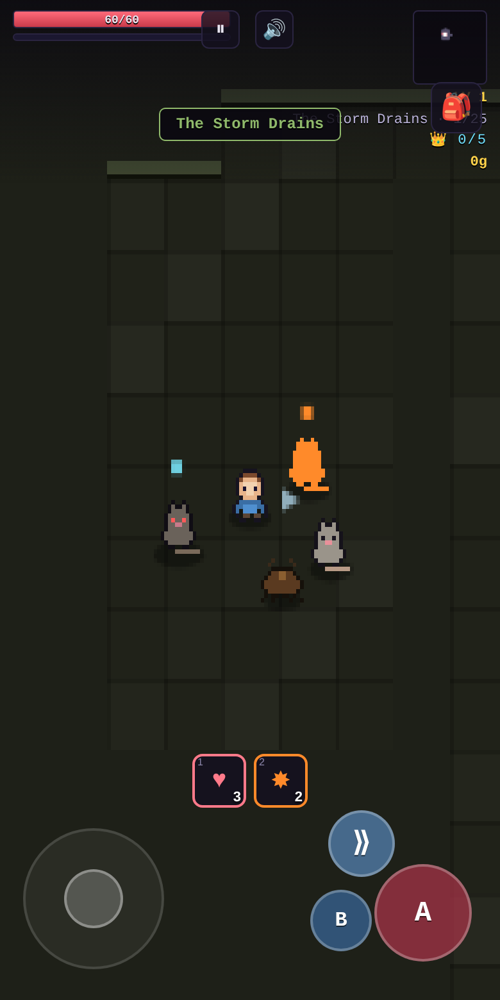

# Shardfall

A top-down **pixel dungeon-crawler RPG** that runs entirely in the browser.

You're a **sewerjack**: the city's taps run brown and the fever wards are full,
because something has taken over the drains. Descend five sewer zones, fight
**rats and mutants**, take five crowns, and end the **Rat King** so the city can
drink again. 25 floors, 5 telegraphed boss fights, loot with rarities + affixes,
status effects, consumables, a dash-based skill combat system, a between-acts hub
(merchant + forge), and New Game+.

**No frameworks, no build step, no asset files.** Every sprite is drawn pixel by
pixel in code; every sound is synthesized with the Web Audio API. The whole game
is plain HTML + CSS + ES-module JavaScript.



> 🎮 **Play:** https://shardfall.night.enkiduck.com *(self-hosted preview; may not always be up)*

---

## Run it

It's a static site — any static server works.

```bash
npm run serve      # -> http://localhost:8000   (zero dependencies for serving)
# or
python3 -m http.server 8000
```

Then open the URL on a desktop or phone.

### Docker (nginx + Traefik preview)

```bash
docker compose up -d   # serves the source files directly; see docker-compose.yml
```

### Deploy to a static host

```bash
npm run build                 # copies the static files into dist/
npx wrangler pages deploy .   # Cloudflare Pages (or push dist/ to any static host)
```

---

## Controls

| Action   | Keyboard            | Touch                |
|----------|---------------------|----------------------|
| Move     | WASD / Arrows       | Left joystick        |
| Strike   | J / Space           | **A** button         |
| Dash (i-frames) | K / Shift    | **⟫** button         |
| Interact | E                   | **B** button         |
| Use item | 1–9                 | Consumable quick-bar |
| Gear / Codex | I               | 🎒 button            |

**Dash is the core skill mechanic** — it grants invincibility frames, so boss
attacks (which are all telegraphed with a warning ring) are dodged on timing.

---

## Features

- **5 sewer zones / 25 floors** — Storm Drains → Overflow Cisterns → Sludge Works → Plague Warrens → the King's Throne — each a distinct biome (palette + enemy roster), procedurally generated.
- **Rats & mutants** — rats, roaches, big rats, plague rats, sludge, mutants, ghouls, scavengers, armored mutants, plus elites.
- **5 bosses** with unique, telegraphed attack patterns and HP phases, ending with the **Rat King**.
- **Skill combat** — a **dash with i-frames** is the core mechanic; every boss special is **telegraphed** with a warning ring so attacks are dodged on timing, not luck.
- **Status effects** — burn, poison (stacks), chill (slow), stun — on enemies, bosses, and the player.
- **Loot** — 5 rarities, 3 gear slots (weapon/armor/ring) with rolled stats, plus **weapon affixes** (Flaming, Venomous, Frost, Shocking, Cleaving, Heavy, Vampiric) that change how you fight.
- **Consumables** — potions, throwable bombs (fire/frost/venom AoE), and buff elixirs (rage, stoneskin).
- **Sanctum hub** after each boss — full heal, a **merchant** (buy/reroll), and a **forge** (reforge gear with gold).
- **Quality-of-life** — explored-tile minimap, off-screen boss arrow, low-HP danger vignette, hit-stop on crits/kills, facing indicator, mobile haptics, a **pause menu** with sound/screen-shake/haptics toggles, and first-run control tips.
- **Gold economy**, **procedural sound** with mute, **localStorage autosave**, **New Game+** (keep your build, harder enemies).
- **Story & Codex** — opening, per-zone intros, boss dialogue, an epilogue, and 20 sewer lore fragments found at shrines.

---

## Project layout

```
index.html        DOM scaffold: canvas + HUD + modals
styles.css        all styling (mobile-first)
js/
  main.js         bootstrap
  game.js         the Game class — loop, state machine, combat, physics, render, save
  content.js      DATA: acts, biomes, enemies, bosses, story, lore  ← add content here
  items.js        item / affix / consumable generation, rarities, scoring
  dungeon.js      procedural floor + sanctum generation, collision
  sprites.js      char-grid pixel sprites + drawSprite()
  input.js        unified keyboard + touch input
  ui.js           DOM UI (HUD, dialog, inventory, shop, forge, overlays)
  audio.js        procedural Web Audio SFX
  rng.js          seeded RNG
smoke.mjs         headless Puppeteer test (31 assertions) — `npm test`
serve.mjs         tiny static dev server — `npm run serve`
docker-compose.yml / nginx.conf   container deploy
```

**Working on the code (human or AI)? Read [`AGENTS.md`](AGENTS.md)** — it documents
the architecture, the data-driven content model, the test/deploy workflow, and the
gotchas.

## License

MIT
